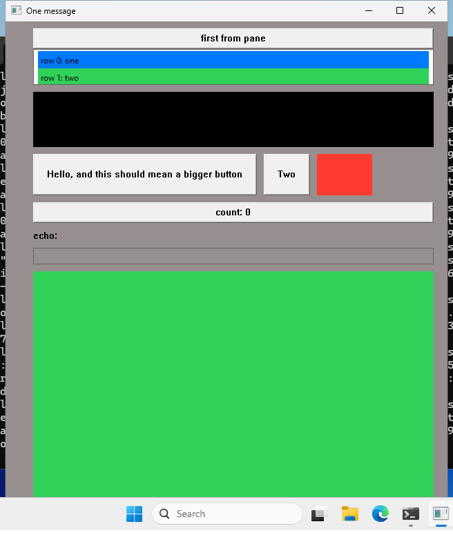
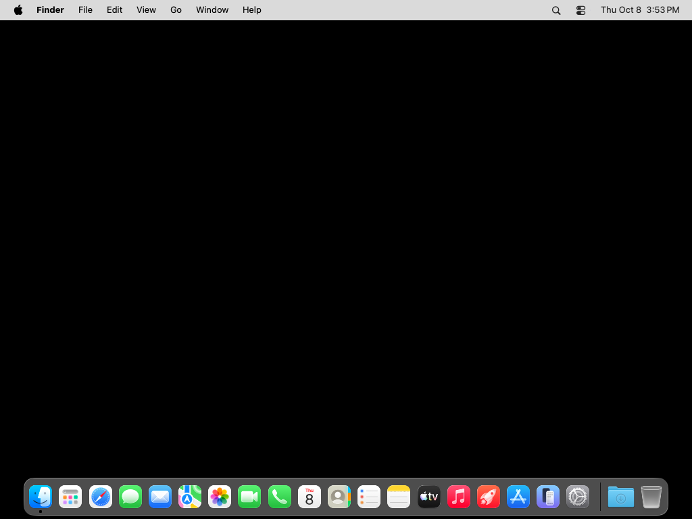

# Window_of_opportunity

A WIP, aiming to implement a react style library for creating native (as in, using the actual OS primitives) GUIs. 

Currently targetting Win32 directly via the windows crate, and Macos with AppKit (using Cacao under the hood).

## Features

* Input boxes support internationalization because they are the native input boxes.
<!-- SIZE:BEGIN (generated by scripts/update_readme.mjs - do not edit by hand) -->
* Small binaries - the `simples` example compiles to ?kb for Windows, and ?Mb for Mac, in release.
<!-- SIZE:END -->

## Getting started

The simplest possible app would look like this:

```rust
use window_of_opportunity::{app::Application, component::Component, ui};

#[derive(Debug, Default)]
struct Window {}
impl Component for Window {
    fn render(
        &self,
        ctx: &window_of_opportunity::state::Ctx,
        _children: Vec<Box<window_of_opportunity::element::Element>>,
    ) -> Box<window_of_opportunity::element::Element> {
        let first = ctx.use_state("first", || true);
        let switch = ctx.set_state("first", |f: &mut bool| *f = !*f);
        let title = if first {
            "One message"
        } else {
            "Another message"
        };
        ui! {
            Window width(600.) height(500) title(title) {
                { Div direction("column") gap(40.) padding(16.) {
                    { Div height(80.) background("blue") {} }
                    { Div direction("row") gap(10.) height(60.) {
                        { Button { Text "Hello, and this should mean a bigger button" } }
                        { Button on_click(switch) { Text "Click to change the title" } }
                        { Div grow(true)  background("red") {} }
                    } }
                    { Div height(40.) background("green") {} }
                } }
            }
        }
    }
}

fn main() {
    let window = Box::new(Window {});
    let app = Application {};

    app.run(window, |_state, _message: ()| ())
}
```

Checkout the examples folder for the kinds of controls you can currently use, and how you'd use the different handlers. Run using `cargo run --example todos` or any of the other examples.

## Screenshot

<!-- SHOT:BEGIN (generated by scripts/update_readme.mjs - do not edit by hand) -->
The `simples` example running natively on each platform:

| Windows | macOS |
| ------- | ----- |
|  |  |
<!-- SHOT:END -->

## Windows theming (comctl32 v6)

On Windows, the examples in this repo run with the classic Win9x visual style because Cargo's example targets don't automatically receive embedded manifests from library build scripts. If you create a **binary crate** that depends on `window_of_opportunity`, embed a manifest that requests `comctl32` version 6 to get the modern themed look (gradients, rounded edit borders, etc.):

1. Add an `app.manifest` file next to your `Cargo.toml`:

```xml
<?xml version="1.0" encoding="UTF-8" standalone="yes"?>
    <assembly xmlns="urn:schemas-microsoft-com:asm.v1" manifestVersion="1.0">
    <assemblyIdentity version="<your version here>" processorArchitecture="*" name="<shortname>" type="win32"/>
    <description>longer description here</description>
  <dependency>
    <dependentAssembly>
      <assemblyIdentity
          type="win32"
          name="Microsoft.Windows.Common-Controls"
          version="6.0.0.0"
          processorArchitecture="*"
          publicKeyToken="6595b64144ccf1df"
          language="*" />
    </dependentAssembly>
  </dependency>
  <application xmlns="urn:schemas-microsoft-com:asm.v3">
    <windowsSettings>
      <dpiAware xmlns="http://schemas.microsoft.com/SMI/2005/WindowsSettings">true/pm</dpiAware>
      <dpiAwareness xmlns="http://schemas.microsoft.com/SMI/2016/WindowsSettings">PerMonitorV2</dpiAwareness>
    </windowsSettings>
  </application>
</assembly>
```

2. Add an `app.rc` resource definition file:

```
1 RT_MANIFEST "app.manifest"
```

3. Add `embed-resource` to your `[build-dependencies]` in `Cargo.toml`:

```toml
[build-dependencies]
embed-resource = "3.0"
```

4. Create a `build.rs` in your binary crate:

```rust
fn main() {
    embed_resource::compile("app.rc", embed_resource::NONE)
        .manifest_required()
        .unwrap();
}
```

For a template of these files, see [`app.manifest`](app.manifest) and [`app.rc`](app.rc) in this repository.

## Project Status
The very basic controls are there, and there are hooks for some state.

| Feature | Macos | Win32 | Gtk |
| ------- | ----- | ----- | --- |
| Button | ✅ | ✅ | ❌ |
| Label | ✅ | ✅ | ❌ |
| Image (using BlitFrame) |  ✅ | ❌ | ❌ |
| Input |  ✅ | ✅ | ❌ |
| Window |  ✅ | ✅ | ❌ |
| Window resizing |  ✅ | ✅ | ❌ |
| Window title |  ✅ | ✅ | ❌ |
| Layout |  ✅ | ✅ | ❌ |
| List | ✅ | ✅ (using ListView with customdraw for items) | ❌ |
| Test target | ❌ | ❌ | ❌ |

* Move to directly use objc2 for Macos
* Handle vec based lists
* Add more elements - scrollviews, radiobuttons, comboboxes, selectboxes.
* Add more properties - border, rounded corners, other events
* Get working with win32 (almost feature parity with macos)
* Get working with gtk.
* Add a test target for writing automated tests against the virtual dom